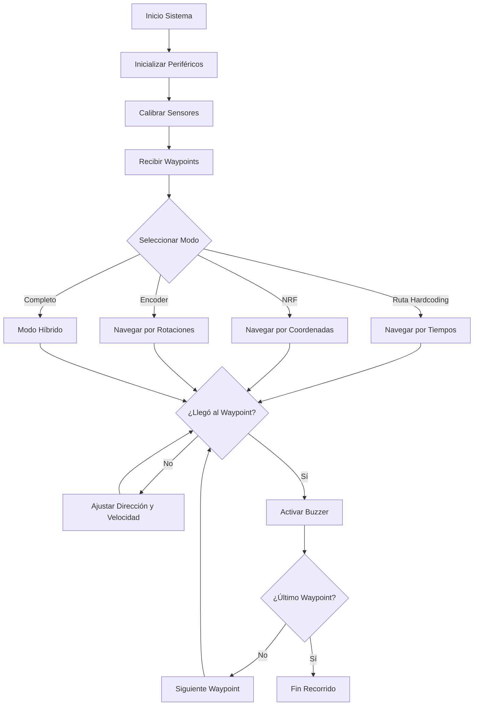

<div align="center">
  
# 🚜 STM32 AUTONOMOUS TRACTOR

[](https://tec.mx)
[](https://www.st.com/)
[](https://github.com/AldonDC/stm32-autonomous-tractor)
[](LICENSE)

### Sistema embebido avanzado para navegación autónoma agrícola
#### Equipo 5 | Noviembre 2024

</div>

<p align="center">
  <a href="#-visión-general">Visión General</a> •
  <a href="#-características-principales">Características</a> •
  <a href="#-arquitectura-del-sistema">Arquitectura</a> •
  <a href="#-hardware-utilizado">Hardware</a> •
  <a href="#%EF%B8%8F-configuración-del-sistema">Configuración</a> •
  <a href="#-implementación">Implementación</a> •
  <a href="#-demostración">Demostración</a> •
  <a href="#-equipo">Equipo</a>
</p>

---

## 🌟 Visión General


El proyecto STM32 Autonomous Tractor implementa un vehículo agrícola a escala con capacidad de navegación autónoma precisa mediante múltiples protocolos de comunicación y sensores avanzados. Diseñado para:

- **Navegación waypoint:** Seguimiento de rutas preestablecidas con precisión
- **Toma de decisiones en tiempo real:** Ajustes dinámicos de velocidad y dirección
- **Comunicación multi-protocolo:** Integración de sistemas mediante SPI, I2C, CAN y UART
- **Redundancia en posicionamiento:** Mayor precisión mediante algoritmos de fusión sensorial
- **Retroalimentación interactiva:** Señales visuales y auditivas durante la operación

<br clear="right"/>

## 🔥 Características Principales

<table>
<tr>
<td width="50%">

### 🧠 Inteligencia Incorporada
- **Navegación adaptativa:** Ajuste dinámico de velocidad en curvas
- **Algoritmos de corrección:** Compensación de errores mediante múltiples fuentes de datos
- **Cálculo de trayectorias:** Determinación de ángulos mediante función arcotangente
- **Detección precisa:** Validación de llegada a waypoints con tolerancia de ±7cm

</td>
<td width="50%">

### 🔌 Comunicación Avanzada
- **Wireless:** Transmisión de coordenadas en tiempo real mediante NRF24L01
- **Bus CAN:** Comunicación robusta entre microcontroladores
- **Sensores I2C:** Lectura de orientación mediante MPU6050
- **UART/SPI:** Interfaces para debugging y dispositivos periféricos

</td>
</tr>
<tr>
<td>

### 🛠️ Hardware Optimizado
- **Microcontrolador dual-core:** STM32H755 con M7/M4 cores
- **Tracción precisa:** Control PWM de motores mediante ESC
- **Dirección servocontrolada:** Giros precisos mediante servomotor
- **Batería LiPo:** Alimentación estable para operación prolongada
- **Chasis personalizado:** Estructura robusta con carcasa MDF

</td>
<td>

### 🚗 Modos de Operación
- **Ruta Hardcoding con Delays:** Navegación temporizada
- **Llegada por NRF:** Posicionamiento inalámbrico
- **Ruta por Encoder:** Navegación basada en rotaciones
- **Ruta Completa:** Integración de todos los sistemas para máxima precisión y redundancia

</td>
</tr>
</table>

## 🏗 Arquitectura del Sistema

El sistema integra múltiples módulos interconectados:

1. **STM32H755 (Núcleo):** Orquesta todas las operaciones y cálculos principales
2. **NRF24L01 (Comunicación):** Recibe coordenadas desde el sistema de posicionamiento
3. **Motores y Actuadores:** Control preciso mediante PWM para dirección y tracción
4. **Sensores de Posición:** IMU (MPU6050) y encoder para medición de movimiento
5. **Arduino (Auxiliar):** Procesamiento secundario para encoder y buzzer
6. **Red CAN:** Permite la comunicación sincronizada entre todos los componentes

## 🛰 Hardware Utilizado

<div align="center">
  <table>
    <tr>
      <td align="center">
        <br/>
        <b>STM32H755</b><br/>
        Microcontrolador Dual-Core<br/>
        (ARM Cortex-M7/M4)
      </td>
      <td align="center">
        <br/>
        <b>NRF24L01</b><br/>
        Módulo de comunicación<br/>
        inalámbrica 2.4GHz
      </td>
      <td align="center">
        <br/>
        <b>MPU6050</b><br/>
        Sensor IMU con<br/>
        acelerómetro y giroscopio
      </td>
    </tr>
    <tr>
      <td align="center">
        <br/>
        <b>MG996R</b><br/>
        Servomotor para<br/>
        control de dirección
      </td>
      <td align="center">
        <br/>
        <b>GA25-370</b><br/>
        Motor DC con<br/>
        encoder integrado
      </td>
      <td align="center">
        <br/>
        <b>TJA1051 + MCP2515</b><br/>
        Transceptor y controlador<br/>
        para comunicación CAN
      </td>
    </tr>
  </table>
</div>

## ⚙️ Configuración del Sistema

### 📊 Mapa de Pines STM32

<div align="center">
  <table>
    <tr>
      <th colspan="4">Configuración de Periféricos STM32H755</th>
    </tr>
    <tr>
      <th>Periférico</th>
      <th>Función</th>
      <th>Pines</th>
      <th>Configuración</th>
    </tr>
    <tr>
      <td rowspan="2"><b>PWM</b></td>
      <td>Servo (Dirección)</td>
      <td>PA6 (TIM13_CH1)</td>
      <td>1-2ms @ 50Hz</td>
    </tr>
    <tr>
      <td>Motor DC (Tracción)</td>
      <td>PA7 (TIM14_CH1)</td>
      <td>1-2ms @ 50Hz</td>
    </tr>
    <tr>
      <td><b>I2C</b></td>
      <td>MPU6050 (IMU)</td>
      <td>PF14 (SCL), PF15 (SDA)</td>
      <td>100kHz, Modo Estándar</td>
    </tr>
    <tr>
      <td><b>SPI</b></td>
      <td>NRF24L01</td>
      <td>PF7 (SCK), PF8 (MISO), PF9 (MOSI), PC6 (CE), PC7 (CSN)</td>
      <td>Modo Maestro, MSB first</td>
    </tr>
    <tr>
      <td><b>CAN</b></td>
      <td>Comunicación con Arduino</td>
      <td>PD0 (RX), PD1 (TX)</td>
      <td>Modo Normal, 500kbit/s</td>
    </tr>
    <tr>
      <td><b>UART</b></td>
      <td>Debugging</td>
      <td>PD8 (TX), PD9 (RX)</td>
      <td>115200 baud, 8N1</td>
    </tr>
  </table>
</div>

### 🔄 Diagrama de Proceso



## 💾 Implementación

<table>
<tr>
<td width="50%">

### 📁 Estructura del Proyecto

```
stm32-autonomous-tractor/
├── Core/
│   ├── Inc/                # Headers
│   │   ├── main.h
│   │   ├── mpu6050.h
│   │   ├── nRF24L01.h
│   │   └── ...
│   └── Src/               # Source files
│       ├── main.c
│       ├── mpu6050.c
│       ├── nRF24L01.c
│       └── ...
├── Drivers/               # HAL drivers
├── Middlewares/          # Middleware
├── Arduino/              # Arduino code
│   └── EncoderBuzzer/
├── Documentation/
│   ├── Diagramas/
│   ├── Imagenes/
│   └── Reporte/
└── README.md
```

</td>
<td width="50%">

### 🧩 Algoritmo de Navegación Principal

```c
void NRFMotorEncoderCAN() {
  uint8_t segmento = 0;
  uint8_t state = 0;
  
  float posiciones[] = {
    1, // Primer avance
    5, // Primera vuelta
    8.5, // Segunda vuelta
    11 // Segundo avance
  };
  
  uint8_t targetsX[] = {230,155,125,125};
  uint8_t targetsY[] = {75,25,75,120};
  
  while (segmento < 5) {
    ProcessNRF24Data();
    ProcessCANMessage();
    
    if((abs(coordX - targetsX[segmento]) <= 10 && 
        abs(coordY - targetsY[segmento]) <= 10) || 
       vueltas >= posiciones[segmento]) {
      
      BrakeMotor();
      ActivateBuzzer();
      segmento++;
      
    } else {
      double targetAngle = atan2(targetsY[segmento] - coordY,
                              targetsX[segmento] - coordX);
      targetAngle = 90 - (targetAngle * 180.0 / M_PI);
      
      // Límites de seguridad
      if(targetAngle > 160) targetAngle = 160;
      if(targetAngle < 20) targetAngle = 20;
      
      Turning_SetAngle(targetAngle);
      
      // Velocidad adaptativa en curvas
      if (targetAngle <= 60 || targetAngle >= 120) {
        SetMotorSpeed(1100); // Más lento en curvas cerradas
      } else {
        SetMotorSpeed(1300); // Velocidad normal
      }
    }
  }
}
```

</td>
</tr>
</table>

### 🚀 Instalación y Uso

1. **Clonar el repositorio:**
   ```bash
   git clone https://github.com/AldonDC/stm32-autonomous-tractor.git
   cd stm32-autonomous-tractor
   ```

2. **Abrir en STM32CubeIDE:**
   - Importar el proyecto
   - Verificar configuración de pines y periféricos
   - Compilar el proyecto

3. **Cargar el código:**
   - Conectar el STM32H755 vía ST-Link
   - Cargar el programa en el microcontrolador
   - Cargar código Arduino en su respectiva placa

4. **Configurar hardware:**
   - Conectar los componentes según el diagrama
   - Verificar las conexiones y alimentación
   - Calibrar sensores si es necesario

5. **Ejecutar el sistema:**
   - Encender el sistema
   - Seleccionar modo de operación
   - Iniciar secuencia de navegación

## 🎬 Demostración

<div align="center">
  <a href="https://drive.google.com/file/d/1VipUzo-c-BnRVilcmz3iSH7LOjSFaA0G/view?usp=sharing">
    
    <br/>
    <b>▶️ Ver video de demostración</b>
  </a>
</div>

## 👨‍💻 Equipo

<div align="center">
  <table>
    <tr>
      <td align="center">
        <b>Alfonso Solís Díaz</b><br/>
        A00838034<br/>
        <i>Implementación, configuración y algoritmos </i>
      </td>
      <td align="center">
        <b>Jesús René Hernández</b><br/>
        A00837617<br/>
        <i>Construcción e integración</i>
      </td>
    </tr>
    <tr>
      <td align="center">
        <b>Juan José Castillo</b><br/>
        A01750541<br/>
        <i>Algoritmos de navegación</i>
      </td>
      <td align="center">
        <b>Felipe García García</b><br/>
        A01705893<br/>
        <i>Diseño mecánico y estructural</i>
      </td>
    </tr>
  </table>
</div>

---

<div align="center">
  <h3>🏆 Diseño de Sistemas Embebidos Avanzados</h3>
  <b>Tecnológico de Monterrey © 2024</b><br/>
  <i>Semestre Agosto-Diciembre</i>
</div>
